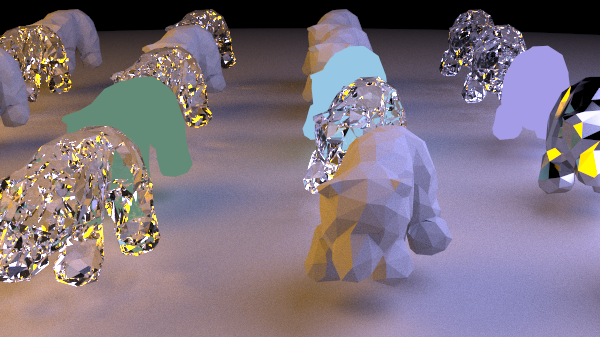

# Offline Raytracing

Starting with the [raytracing tutorial series](https://raytracing.github.io/) by Peter Shirley, Trevor David Black, and Steve Hollasch, this is an offline Monte Carlo raytracer that has support for triangle meshes and multi-core CPU rendering.

