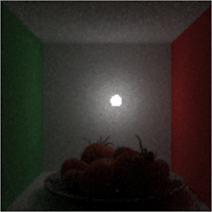
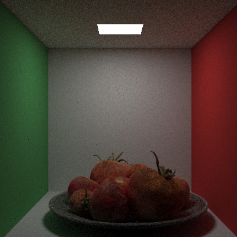
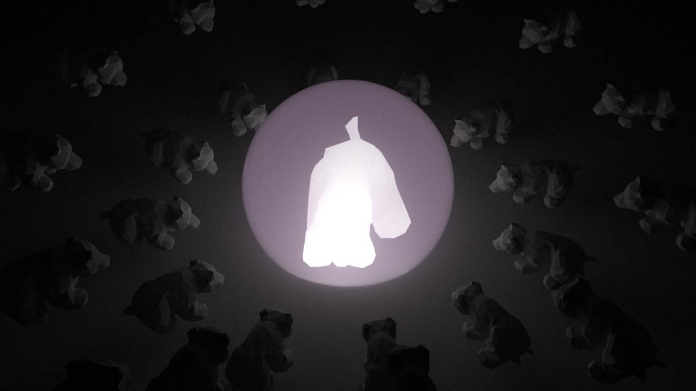
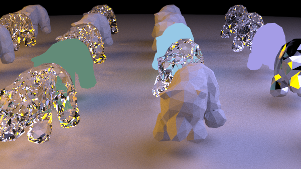
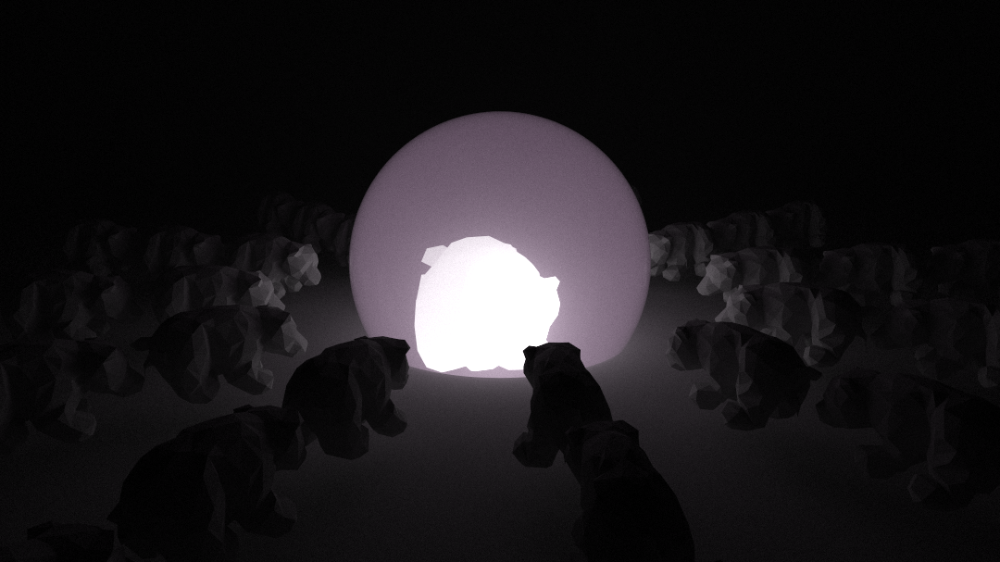

[tomato splat](https://superspl.at/scene/0101ad57) in cornell box.

# Offline Raytracing

Starting with the [raytracing tutorial series](https://raytracing.github.io/) by Peter Shirley, Trevor David Black, and Steve Hollasch, this is an offline Monte Carlo raytracer that has support for triangle meshes and multi-core CPU rendering.

This was then expanded to include Gaussian Splats rendered as stochastically sampled volumetric primitives that are first class citizens in the raytracer. This means they support lighting, reflection, shadows, and everything else any other primitive in the engine supports. 

# Gallery

# Getting started

This project uses: \
[Boost](https://www.boost.org/) \
[Spdlog](https://github.com/gabime/spdlog) \
[STB](https://github.com/nothings/stb) \
[GLM](https://github.com/g-truc/glm) 

# Inspirations

[Unified Gaussian Primitives for Scene Representation and Rendering](https://dl.acm.org/doi/pdf/10.1145/3829352) \
[3DGS In A Weekend](https://bfeldman.me/3dgs-weekend/)

Support for a non-c++ API is not planned and at the moment users must build the project from scratch. This project has only been tested using Visual Studio and C++20 and is not guarenteed to work on other platforms and configurations. \
Aspects of the project might also not work and can be broken on any new release. \
At the moment, this project is *not* optimized and there is not a schedule for further improvements. Expect long render times, bugs, and unsolved issues.

# Contributing

If you would like to contribute to this project please make a pull request.
